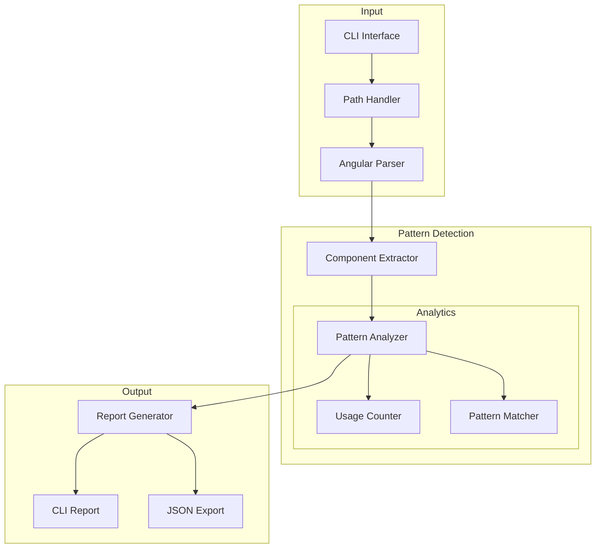

```mermaid
flowchart TB
    subgraph Input
        CLI[CLI Interface] --> P[Path Handler]
        P --> AP[Angular Parser]
    end

    subgraph Core["Pattern Detection"]
        AP --> CE[Component Extractor]
        CE --> PA[Pattern Analyzer]
        
        subgraph Analytics
            PA --> S1[Usage Counter]
            PA --> S2[Pattern Matcher]
        end
    end

    subgraph Output
        PA --> RG[Report Generator]
        RG --> CR[CLI Report]
        RG --> JSON[JSON Export]
    end
```