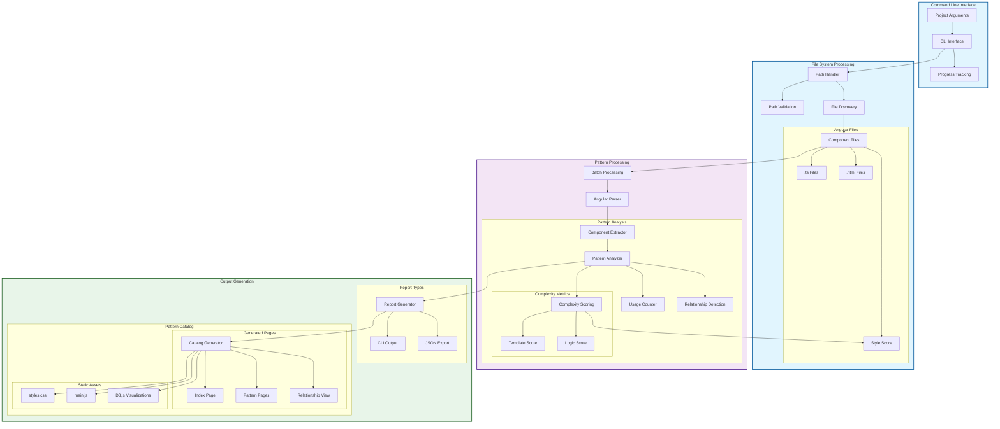

```mermaid
flowchart TB
    %% Main Input Processing Flow
    subgraph CLI["Command Line Interface"]
        ARGS[Project Arguments] --> CLI_INT[CLI Interface]
        CLI_INT --> PROGRESS[Progress Tracking]
    end

    subgraph FileSystem["File System Processing"]
        CLI_INT --> PATH[Path Handler]
        PATH --> VALID[Path Validation]
        PATH --> DISC[File Discovery]
        DISC --> COMP[Component Files]
        
        subgraph Files["Angular Files"]
            COMP --> TS[".ts Files"]
            COMP --> HTML[".html Files"]
            COMP --> STYLE[".scss/.css Files"]
        end
    end

    %% Core Processing
    subgraph Processing["Pattern Processing"]
        COMP --> BATCH[Batch Processing]
        BATCH --> PARSE[Angular Parser]
        PARSE --> EXTRACT[Component Extractor]
        
        subgraph Analysis["Pattern Analysis"]
            EXTRACT --> ANALYZE[Pattern Analyzer]
            ANALYZE --> COMPLEX[Complexity Scoring]
            
            subgraph Metrics["Complexity Metrics"]
                COMPLEX --> TEMP[Template Score]
                COMPLEX --> STYLE[Style Score]
                COMPLEX --> LOGIC[Logic Score]
            end
            
            ANALYZE --> USAGE[Usage Counter]
            ANALYZE --> REL[Relationship Detection]
        end
    end

    %% Output Generation
    subgraph Output["Output Generation"]
        ANALYZE --> REPORT[Report Generator]
        
        subgraph Reports["Report Types"]
            REPORT --> CLI_OUT[CLI Output]
            REPORT --> JSON[JSON Export]
        end
        
        subgraph Catalog["Pattern Catalog"]
            REPORT --> CAT[Catalog Generator]
            
            subgraph Pages["Generated Pages"]
                CAT --> INDEX[Index Page]
                CAT --> PATTERN[Pattern Pages]
                CAT --> REL_VIEW[Relationship View]
            end
            
            subgraph Assets["Static Assets"]
                CAT --> STYLES[styles.css]
                CAT --> SCRIPTS[main.js]
                CAT --> D3[D3.js Visualizations]
            end
        end
    end

    %% Styling
    classDef primary fill:#e1f5fe,stroke:#01579b,stroke-width:2px
    classDef secondary fill:#f3e5f5,stroke:#4a148c,stroke-width:2px
    classDef accent fill:#e8f5e9,stroke:#1b5e20,stroke-width:2px
    
    class CLI,FileSystem primary
    class Processing secondary
    class Output accent
```